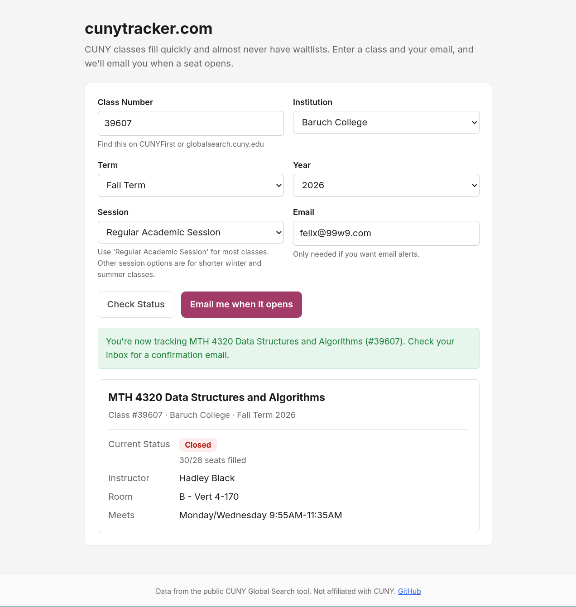

# CUNY Seat Tracker

CUNY class sections often fill quickly and almost never have waitlists. The official tools require manually refreshing to check for open seats and offer no automated notifications. CUNY Tracker lets you enter any class and your email address, and notifies you when a seat opens.

Live site: [cunytracker.com](https://cunytracker.com)



## How it works

Users check a class's current availability on demand and can subscribe to be notified. A scheduler re-checks every tracked class every five minutes. When a section flips from closed or waitlisted to open, it emails each subscriber with a one-click unsubscribe link. Subscriptions and the latest scraped availability live in Postgres, and the scraper, scheduler, and web server run in a single process.



## Design decisions

- Async end-to-end. FastAPI, httpx, and an AsyncIO scheduler share one event loop, so scraping, polling, and serving run as a single process with no broker or separate worker.
- No connection pool. A fresh psycopg connection per query stays correct across Neon's scale-to-zero and PgBouncer transaction pooling.
- Failure isolation. A scrape, parse, or email error is logged and retried on the next cycle. It never takes down the web server.
- Edge-triggered emails. Notify only on a not-open to open transition, and advance a subscriber's stored status only after a successful send. This guarantees no missed opens and no repeat emails while a class stays open.
- RFC 8058 one-click unsubscribe. Gmail and Outlook render a native unsubscribe button, and every email carries a tokenized link.
- Stdlib SMTP, no email service. Emails go out through Python's smtplib over an SMTP account, so the stack carries no transactional-email provider or API key.
  
## Stack

- Python, FastAPI, Uvicorn
- PostgreSQL (Neon) via async psycopg
- APScheduler
- httpx, BeautifulSoup
- Jinja2, vanilla CSS and JS
- Docker on Oracle Cloud ARM

## Run locally

Requires Docker and a Postgres connection string (a free Neon database works)
 
```bash
git clone https://github.com/felixmclean/cuny-tracker
cd cuny-tracker
cp .env.example .env        # set DATABASE_URL and the SMTP values
docker compose up --build
```
 
Without Docker, you'll need Python 3.12+
 
```bash
pip install -r requirements.txt && python app.py
```

## Limitations

The scraper depends on CUNY Global Search's HTML, so a markup change there breaks parsing until the selectors are updated. Notifications are bounded by the poll interval, so a seat that opens is surfaced within about five minutes, not instantly.

## Credit

Endpoint and HTML-parsing logic adapted from [cuny-global-search-bot](https://github.com/mkbhuiyan96/cuny-global-search-bot). The web app, persistence, scheduling, email, and deployment are original.
