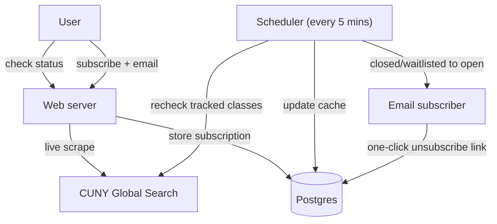

# CUNY Tracker

CUNY classes fill quickly and almost never have waitlists. The official tools require manually refreshing to check for open seats and offer no automated notifications. CUNY Tracker lets you track a closed class and get an email when a seat opens.

Live site: [cunytracker.com](https://cunytracker.com)


## How it works

You can check a class's current availability and subscribe to get an email when it opens. A scheduler rechecks all tracked classes every five minutes, and when a class goes from closed or waitlisted to open, it emails each subscriber. Subscriptions and the latest scraped data are stored in Postgres. The scraper, scheduler, and web server all run in a single process.



## Design decisions

- Single async process. FastAPI, httpx, and an AsyncIO scheduler share one event loop so scraping, polling, and serving all run together without a message broker or separate worker.
- No connection pool. Each query opens its own psycopg connection which makes it compatible with Neon's scale-to-zero design and PgBouncer's transaction pooling.
- Failure isolation. Any scrape, parse, or email error is logged and retried on the next cycle so it never takes down the web server.
- Status only updates after a successful send. Emails only send on a closed-to-open transition, and a subscriber's stored status only updates once the email is actually sent which avoids missed or repeated notifications while a class stays open.
- One-click unsubscribe (RFC 8058). Gmail and Outlook render a native unsubscribe button and every email carries a tokenized link.
  
## Stack

- Python, FastAPI, Uvicorn
- PostgreSQL (Neon) via async psycopg
- APScheduler
- httpx, BeautifulSoup
- Jinja2, vanilla CSS and JS
- Resend (SMTP) for email delivery
- Docker, Nginx, Let's Encrypt on Oracle Cloud

## Run locally

Requires a Postgres connection string (a free Neon database works)

with Docker:
```bash
git clone https://github.com/felixmclean/cuny-tracker
cd cuny-tracker
cp .env.example .env        # set DATABASE_URL and the SMTP values
docker compose up --build
```

with Python:
```bash
pip install -r requirements.txt && python app.py
```

## Limitations

The scraper depends on CUNY Global Search's HTML. A markup change there may break parsing until the selectors are updated. Notifications are also bounded by the poll interval so an open seat might take up to five minutes to be detected. 

## Credit

Endpoint and HTML-parsing logic adapted from [cuny-global-search-bot](https://github.com/mkbhuiyan96/cuny-global-search-bot). The web app, persistence, scheduling, email, and deployment are original.
